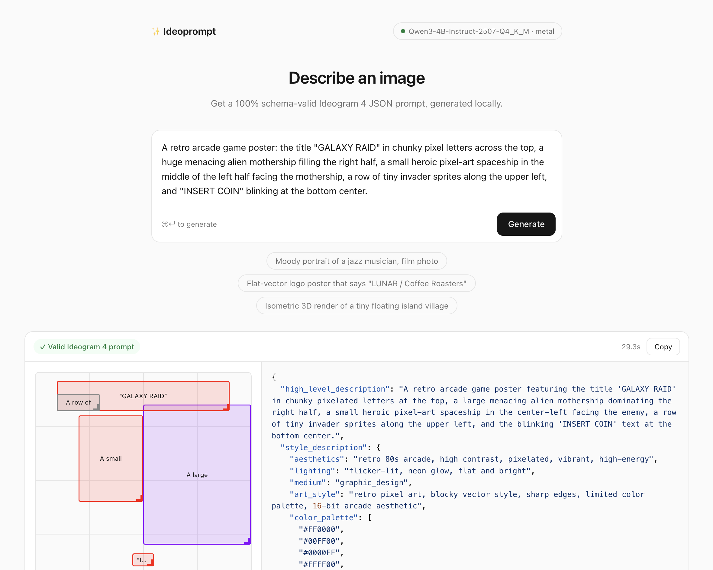

# Ideoprompt



Describe an image in plain English and get an **Ideogram 4 structured JSON prompt** that is **guaranteed to validate** against the official Ideogram 4 caption schema.

Everything runs locally: the LLM (Qwen3-4B-Instruct-2507) is embedded in the app via [node-llama-cpp](https://node-llama-cpp.withcat.ai/) (llama.cpp bindings).

# What it does

Ideogram 4 was trained on structured JSON captions, and feeding it a JSON caption gives far better controllability (spatial layout via bounding boxes, exact text rendering, color palette conditioning) than plain text — but the JSON has strict rules (required fields, strict key order, `[y_min, x_min, y_max, x_max]` 0–1000 bboxes, uppercase `#RRGGBB` colors, photo vs. art-style variants) and hand-writing it is error-prone.

Ideoprompt converts a plain description into a valid caption with a three-layer guarantee, so the output is valid by construction rather than by luck:

1. **Grammar-constrained decoding** — the model's token sampling is constrained by a GBNF grammar compiled from the schema; it *cannot* emit malformed JSON, wrong keys, wrong key order, or wrong types.
2. **Deterministic normalization** — hex colors are uppercased and de-duplicated, bboxes clamped to 0–1000 and ordered, palette sizes capped (16 style / 5 per element), keys re-serialized in the canonical order from the official docs.
3. **Validation gate** — the result must pass AJV validation against the complete official JSON Schema plus key-order checks before it is shown. On the rare failure, the app regenerates once automatically with the errors in context.

Schema reference: [Ideogram 4 prompting docs](https://github.com/ideogram-oss/ideogram4/blob/main/docs/prompting.md).

# Install

## 1. One Click Install

[Recommended] You can easily run this with one click.

Install [Pinokio](https://pinokio.co), then open this project in Pinokio and click **Install**. Pinokio takes care of everything — Node.js, npm dependencies, and the model download — and gives you one-click **Start**, **Update**, and **Reset** buttons.

## 2. Manually Install

Or if you want to install manually in terminal:

Prerequisites: [Node.js](https://nodejs.org) ≥ 20 and the [Hugging Face CLI](https://huggingface.co/docs/huggingface_hub/guides/cli) (or any way to download a file from Hugging Face).

```bash
# 1. Install dependencies (node-llama-cpp ships prebuilt llama.cpp binaries
#    for macOS/Windows/Linux — no compiler toolchain needed)
cd app
npm install

# 2. Download the model (~2.5 GB) into app/models/
hf download unsloth/Qwen3-4B-Instruct-2507-GGUF Qwen3-4B-Instruct-2507-Q4_K_M.gguf --local-dir models

# 3. Start the server
node server.mjs
```

Then open http://127.0.0.1:8123 in your browser. To use a different port or model, set `PORT` / `MODEL_PATH` (see [Configuration](#configuration)).

If you don't have the Hugging Face CLI, this direct download works too:

```bash
mkdir -p models
curl -L -o models/Qwen3-4B-Instruct-2507-Q4_K_M.gguf \
  https://huggingface.co/unsloth/Qwen3-4B-Instruct-2507-GGUF/resolve/main/Qwen3-4B-Instruct-2507-Q4_K_M.gguf
```

# How to use

1. **Start** the app (Pinokio's **Start** button, or `node server.mjs` from `app/` if installed manually) — the model loads (GPU via Metal/CUDA/Vulkan when available, CPU otherwise) and the web UI opens.
2. Type a description (e.g. *“A flat vector poster for a synthwave festival called "NEON HORIZON"”*) and press **Generate** (or ⌘↵).
3. When the **✓ Valid Ideogram 4 prompt** badge appears, a **layout preview** shows each element's bounding box on the 0–1000 canvas. Drag a box to move it, or pull its bottom-right corner to resize — the `bbox` coordinates in the JSON update live (clamped to the canvas, so the prompt stays schema-valid).
4. Click **Copy** to copy the compact JSON — including any layout edits — and paste it as your Ideogram 4 prompt.

Tips:
- Put text you want rendered in the image inside "double quotes" — it is copied into `text` elements literally.
- Name a medium ("photo", "watercolor", "pixel art", "logo"...) to steer `style_description`; otherwise the app picks the most natural one.
- Generation takes roughly 20–60 s on Apple Silicon / a modern GPU, longer on CPU-only machines.

# API

The server exposes a small HTTP API on `127.0.0.1` (the port is assigned by Pinokio; it is shown in the browser address bar, `8123` is the default when run manually).

## Endpoints

| Method | Path | Description |
| --- | --- | --- |
| `POST` | `/api/generate` | Body `{"description": "..."}`. Streams NDJSON events: `{"type":"chunk","text":...}` while generating, then one final `{"type":"done","prompt":{...},"prompt_compact":"...","valid":true,"attempts":1,"duration_ms":...}` (or `{"type":"error",...}`). |
| `GET` | `/api/health` | `{"status":"ok","model":"<model>.gguf","gpu":"metal"}` — only responds once the model is loaded. |
| `GET` | `/api/schema` | The full Ideogram 4 JSON Schema used for validation. |

## curl

```bash
curl -s -X POST http://127.0.0.1:8123/api/generate \
  -H "Content-Type: application/json" \
  -d '{"description": "A cozy bookshop storefront at dusk"}' | tail -1 | jq .prompt
```

## JavaScript

```javascript
const res = await fetch("http://127.0.0.1:8123/api/generate", {
  method: "POST",
  headers: { "Content-Type": "application/json" },
  body: JSON.stringify({ description: "A cozy bookshop storefront at dusk" })
});
const lines = (await res.text()).trim().split("\n").map(JSON.parse);
const done = lines.find(e => e.type === "done");
console.log(done.valid, done.prompt);        // true, { high_level_description: ... }
console.log(done.prompt_compact);            // compact string, ready to paste
```

## Python

```python
import json, requests

res = requests.post(
    "http://127.0.0.1:8123/api/generate",
    json={"description": "A cozy bookshop storefront at dusk"},
    stream=True,
)
for line in res.iter_lines():
    event = json.loads(line)
    if event["type"] == "done":
        print(event["valid"], event["prompt_compact"])
```

# Project layout

```
ideoprompt/
├── app/                        # Self-contained app
│   ├── server.mjs              # HTTP server + generation pipeline
│   ├── public/index.html       # Web UI
│   ├── src/
│   │   ├── ideogram-schema.mjs # Official Ideogram 4 JSON Schema (AJV) + key orders
│   │   ├── generation-schema.mjs # Grammar schema for constrained decoding
│   │   ├── normalize.mjs       # Deterministic canonicalization
│   │   ├── validate.mjs        # AJV + key-order validation gate
│   │   └── prompt.mjs          # System prompt + few-shot examples
│   └── models/                 # GGUF model (downloaded by install.js)
├── install.js / start.js / update.js / reset.js / pinokio.js / pinokio.json
└── README.md
```

# Configuration

Environment variables read by `app/server.mjs`:

- `PORT` — listen port (set automatically by the Pinokio launcher).
- `MODEL_PATH` — path to an alternative `.gguf` model (default: first `.gguf` in `app/models/`). Any llama.cpp-compatible instruct model works; non-thinking instruct models are recommended since the grammar constrains output from the first token.
- `CONTEXT_SIZE` — context window (default 8192).
